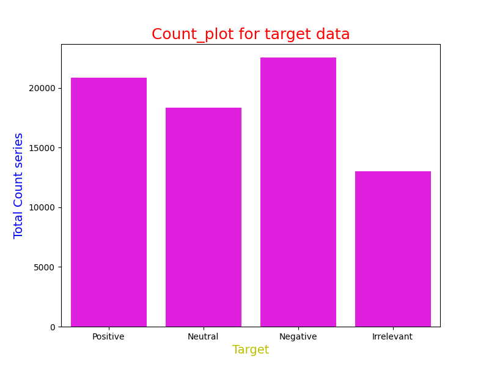
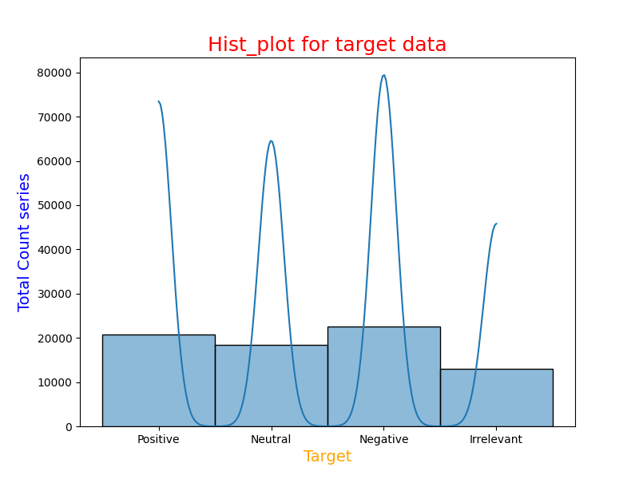
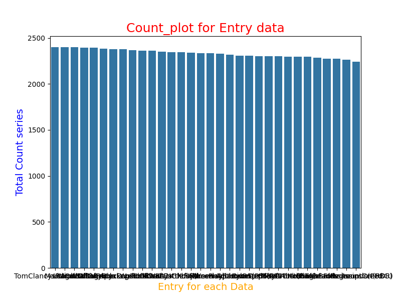
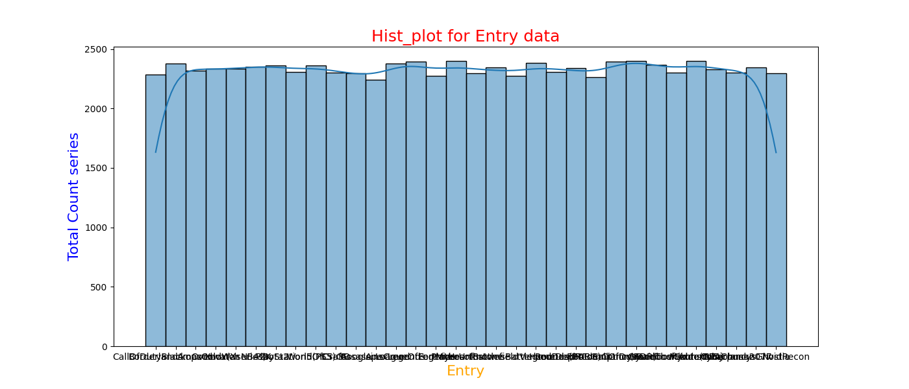
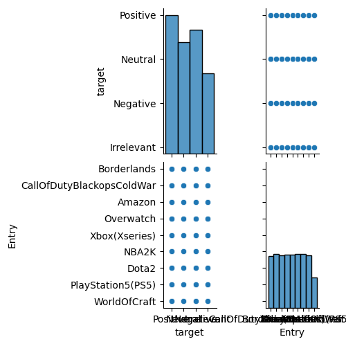
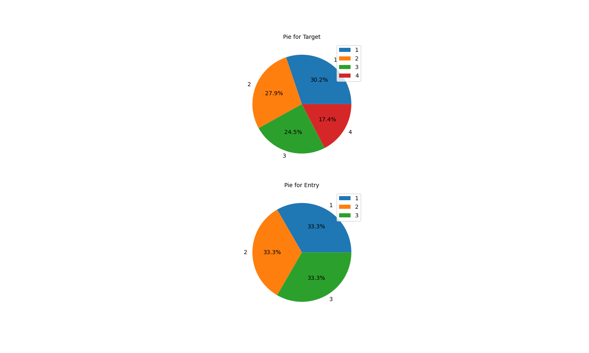
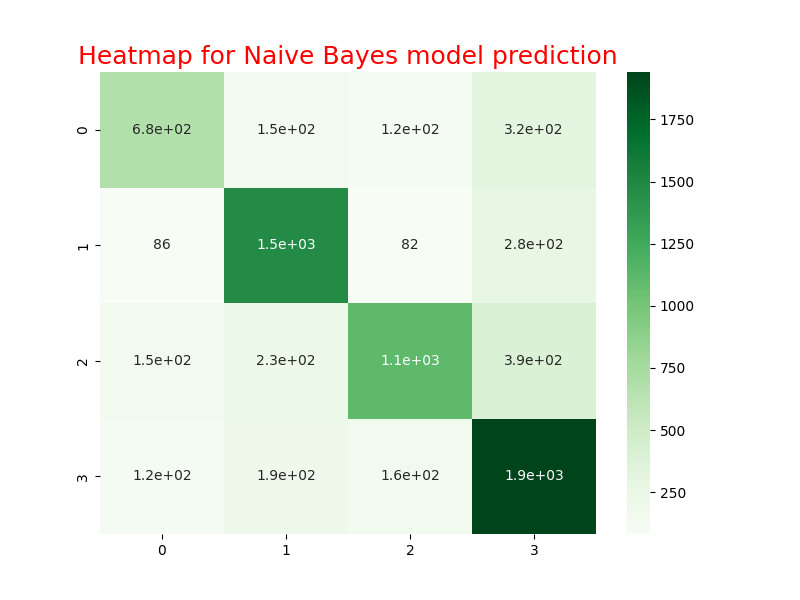
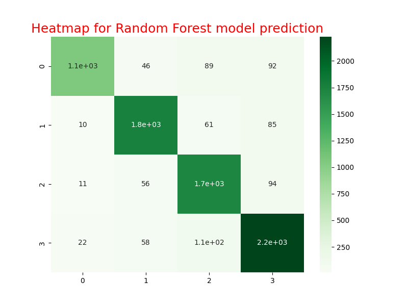

# Twitter Sentiment Analysis

This project involves analyzing Twitter sentiment data using various machine learning models. The analysis includes data visualization, text processing, and sentiment prediction.

## Table of Contents
- [Overview](#overview)
- [Installation](#installation)
- [Usage](#usage)
- [Data Visualization](#data-visualization)
- [Text Processing](#text-processing)
- [Model Training and Evaluation](#model-training-and-evaluation)
- [Sentiment Prediction](#sentiment-prediction)
- [Results](#results)

## Overview
This project utilizes a dataset of tweets to perform sentiment analysis. The code reads the dataset, performs exploratory data analysis, preprocesses the text, and trains multiple machine learning models to classify sentiments. Additionally, visualizations such as count plots, histograms, and pie charts are generated to better understand the data.

## Installation

To install the required dependencies, run the following command:

```bash
pip install pandas==2.0.3 numpy==1.24.3 seaborn==0.12.2 matplotlib==3.8.0 scikit-learn==1.3.0 nltk==3.8.1 wordcloud==1.9.2
```

## Usage

1. Clone this repository.
2. Ensure the required packages are installed by running the installation command above.
3. Run the script in a Python environment to generate visualizations and train the models.

```bash
python Task_4.py
```

## Data Visualization

### Target Count Plot
This plot shows the distribution of sentiment labels (`target`) in the dataset.



### Target Histogram Plot
This histogram represents the distribution of sentiment labels (`target`).



### Entry Count Plot
This plot displays the frequency of entries in the dataset.



### Entry Histogram Plot
This histogram represents the distribution of entries in the dataset.



### Pair Plot
A pair plot visualizing the relationship between `target` and `Entry`.



### Pie Charts
These pie charts represent the distribution of values in the `target` and `Entry` columns.



## Text Processing
Text processing steps include:
- Lowercasing the text
- Removing punctuation
- Tokenizing the text

Processed text is then vectorized using `CountVectorizer`.

## Model Training and Evaluation

### Naive Bayes Model
The Naive Bayes model is trained on the processed data and its performance is evaluated.



### Random Forest Classifier
The Random Forest Classifier model is trained and evaluated on the dataset.



### Decision Tree Classifier
The Decision Tree Classifier model is also trained and its performance is evaluated.


## Sentiment Prediction
You can predict the sentiment of custom text inputs using the trained models.

Example:
```python
predict_sentiment("I love this film")
predict_sentiment("I hate this film")
```

## Results
The models show varying levels of accuracy in predicting the sentiment of the tweets. The Random Forest Classifier and Decision Tree Classifier generally perform better than the Naive Bayes model.

---

## Contributing
Feel free to submit pull requests to improve the analysis or add new features.

## License
This project is licensed under the MIT License.
```

### Steps to Generate Images:
1. Run the code to generate visualizations.
2. Save each plot as an image file using `plt.savefig("filename.png")`.
3. Replace `path_to_image` in the `README.md` with the paths to your saved images.

This `README.md` file provides a comprehensive overview of your project and guides users on how to run the code and understand the outputs.